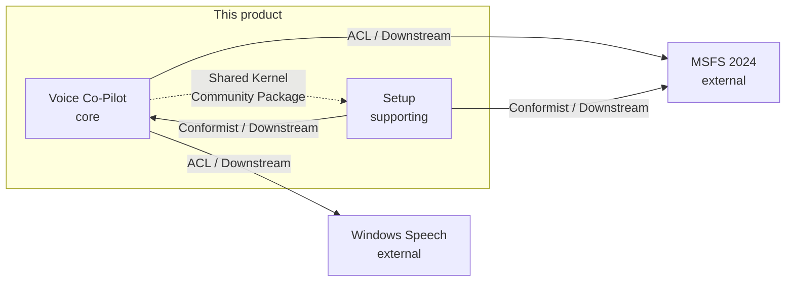
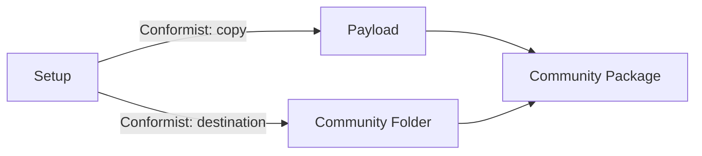
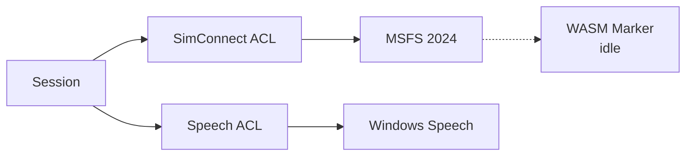

# Context Map

This product is one private Voice Co-Pilot. The core model lives in one bounded context. Setup delivers that context’s Community Package. MSFS 2024 and Windows Speech are external systems the Host adapts to — they do not share the co-pilot language.

Language for the core: [CONTEXT.md](CONTEXT.md).

## Contexts

- **Voice Co-Pilot** (core) — [CONTEXT.md](CONTEXT.md). The Session: Phrase, Command Catalog, Checklist, Learn, Settings, Live / Offline. GUI and Headless are shells of this context, not neighbors.
- **Setup** (supporting) — separate installer process. Community Folder, Payload, Config Preserve, shortcuts. It does not own Commands. Terms today: [CONTEXT.md](CONTEXT.md#delivery).
- **MSFS 2024** (external) — simulator, Community Folder, SimConnect, aircraft TITLE / ATC MODEL, Events and SimVars.
- **Windows Speech** (external) — desktop STT hypotheses and SAPI voices. WAV Callouts are Host data, not this system.

## What is not a context

These share the Voice Co-Pilot Session and glossary. They are subdomains or shells, not boundaries.

- **Checklist**, **Learn Mode**, **Manual**, Commands editor
- **GUI** vs **Headless**
- **WASM Marker** — package presence only; part of the Shared Kernel, not a model

Do not add a context for an aircraft, a profile, or a TTS engine.

## Relationships

| From | To | Pattern | Meaning |
|------|----|---------|---------|
| Voice Co-Pilot | MSFS 2024 | Downstream, **Anti-Corruption Layer** | The Host speaks Command, Condition, Action, Live. SimConnect types stay behind the adapter. |
| Voice Co-Pilot | Windows Speech | Downstream, **Anti-Corruption Layer** | The Host speaks Phrase, Residual, Speech Gate, Hypothesis, Callout. Engine transcripts and SAPI voices stay behind the adapter. |
| Setup | Voice Co-Pilot package | Downstream, **Conformist** | Setup copies the package as published. It does not interpret Commands, Checklists, or Settings. |
| Setup | MSFS 2024 | Downstream, **Conformist** | Setup adopts the Community Folder. It does not invent an install location. |
| Voice Co-Pilot ↔ Setup | — | **Shared Kernel** | Community Package contract only (below). |
| Voice Co-Pilot catalog | Editors / Learn / voice | **Published Language** | Command and Checklist JSON. Setup does not speak it. |

There is no Partnership, no Customer/Supplier protocol, and no Separate Ways. The Host runs without Setup. Both must still keep the package contract.

## Shared Kernel

The **Community Package** is the only shared model:

- Package name `private-utility-copilot-voice`
- `manifest.json` identity
- `extras/` — Host, config, voices
- WASM Marker as “package loaded”, nothing else

Not in the kernel: Command, Phrase, Checklist, Learn, Settings, SimVar Snapshot, Payload internals beyond that layout.

## Language ownership

| Term | Owner |
|------|--------|
| Command, Phrase, Speech Gate, Catalog, Checklist, Learn, Live, Aircraft Profile | Voice Co-Pilot |
| Community Package, extras, WASM Marker | Shared Kernel |
| Payload, Setup, Config Preserve, Community Folder (as install target) | Setup |
| TITLE, ATC MODEL, SimConnect Event, SimVar (sim-native) | MSFS 2024 — enter the Host only as Detected Aircraft, Event, Set SimVar, Snapshot |
| Raw STT text / SAPI voice | Windows Speech — enter the Host only as Phrase / Hypothesis / Callout |

## Diagrams

### Context map

### Install-time

Setup is downstream of both the package contract and the Community Folder. MSFS is not running the Host.

### Run-time

The Host Session talks to MSFS and Windows Speech through ACLs. The WASM Marker stays idle. Setup is not in the loop.

The SimConnect and Speech adapters *are* the anti-corruption layers. Core language stays Command, Condition, Phrase, Snapshot — not vendor SDK types.
